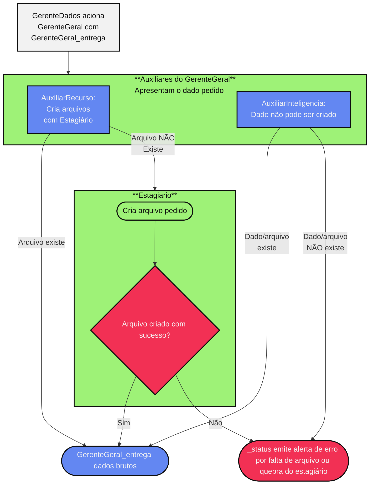

# ADEGPRO CHANGELOG

ADEGPRO - Analisador de dados e Estratégia para o Grand Prix Racing Online

---

## [V5.15.6.0.0] - 28/08/2025 

Arquivos agora são centralizados nos gerentes em vez de espalhados pelo código.

Janela Wizard tem toda a logica inicial de coleta de dados do usuário e temporada.


### Gerentes modificados 

#### Gerente Geral
Agora está mais organizado

função gerente_geral -> classe GerenteGeral


##### **Fluxograma GerenteGeral**



#### Gerente Dados


---

## [V5.15.5.2.0] - 27/08/2025

### **Adições**

- controlador de ajuste de contagem regressiva

### **Mudanças**

- versão 5.1 implementada em adegpro.py
- Remoção de informação poluente na barra de título e rodapé
- Troca das janelas de diálogo iniciais para adição de configuraçõs iniciais por uma janela do tipo wizard.

### **Correções**

- Contador agora está sincronizado com site oficial

### **Precisa corrigir**

- Rodapé está perdendo as referências dependendo da situação com o wizard: O programa perde o caminho das informações dos arquivos mesmo sabendo onde estão

## [V5.15.5.1.0] - 26/08/2025

### **Imports**

yaml,
from Qt6.QtGui Import QIcon
from  Qt6.QtGui Core import Qdate

### **outras mudanças**

- O menú resumo dos circuitos migrou para o menu ajuda.
- Mudança de método de busca das informações do:

1. nome do jogador
2. grupo
3. data e hora da próxima corrida
4. nome do circuito
5. número da temporada e próxima corrida

- Adição de barra de mensagens dinâmica no rodapé.

- `def aplicar_estilo(app):` virou `def app_tema(app):` nos conteúdos dos arquivos de tema.

**Adição de Save**

- de registro da temporada em: `arquivo/temporada_*.yaml`
que estava faltando
- de registro do Jogador em: `arquivo/jogador.yaml`

### **correção de erros**

- Erro dos Temas corrigido

**próximas modificações e correções**
No código rodapé, título e cabeçalho referem-se a mesma coisa. Precisam ser ajustadas as coisas certas com seus nomes corretos.
Tem muita informação de cabeçalho redundante que poderia ficar apenas em uma linha no rodapé
Resumo dos circuitos precisa estar no menu ajuda.

## [5.15.5.0.0] - 24/08/2025

**Adicionado**
Inserção de calendário da temporada
Informação resumida de todos os circuitos

**Erros a consertar**
Temas quebrou.
Calendário inserido não salva em lugar nenhum.
Resumo dos circuitos precisa estar no menu ajuda.
Atualização do rodapé.

## [5.15.4.0.0] - 13-08-2025

### Adicionado

Nova interface em QT6 completa com temas em configurações.

**Aquivo de estratégia em docs**
 mais detalhado para seguir como caminho de desenvolvimento.

**Formulário de dados.md**
Produzido a partir dos arquivos de estratégia: Torna a produção do programa mais linear organizada e planejada indicando em que fase o desenvolvimento do software está e o que falta.

Estrutura nova dos arquivos
ADEGPRO/__init__.py
  Arquivo/__init__.py
    temas/__init__.py
      noturno.py
      diurno.py
      personalizado.py
      README.md
      CHANGELOG.md
    geral.xlsx
    criador_geral.py
    relatorio_gregorio.log
    README.md
  dados/__init__.py
    replays/__init__.py
      GProReplay.exe
      GProReplay.py
      README.md
    README.md
    comandos disponíveis.md
    desg_peça.yaml
    desg_pneus.py
    numeros constantes.txt
  docs/__init__.py **arquivo de informações sobre o projeto**
    Estratégia/
      1_O campeão dos Dados.md
      1ºpasso.md
      2_Estratégia.md
      3_AjusteTreino.md
      4_QualificaçãoQ1.md
      5_Testes na Pista de Testes.md
      6_Q2 e Planejamento da Largada.md
      7_Estratégias de Largada.md
      Formulário de dados.md **usar este arquivo como plano resumido de produção**
      gerenciamento de peças.md
      Resumo.md
      Visão Geral do Grand Prix Racing Online (GPRO).md
    REFERENCIA/ **arquivos de referência para decisão estética**
    Calculo combustível gproanalyzer.txt
    Cálculo preditivo_pit-stops_adversários.md
    calculos para valores de registro_constantes.md
    código_V12_save.txt **ultima versão estável e funcional**
    código_V12_stable.py **ultima versão estável e funcional**
    commit_template.txt **padrão de commit**
    desgaste peças dados.txt
    Desgaste de pneus dados.txt
    desgaste pneus.md
    dicas_comunidade.md
    documentação_produção_ADEGPro.md
    escolha pneus.md
    estrutura_da_minha_cabeça.md **como deve ser enxergado a organizção de pastas**
    formulas.md **arquivo de calculos e fórmulas para o programa**
    Guia do iniciante.md
    Guia Estratégico de Gerenciamento de Peças.md
    para a ia.md **formatação de prompt para trabalho em conjunto com IA**
    Piloto.md **infomrações sobre piloto e seus atributos**
    README.md **informações sobre a pasta docs**
    Roteiro.md **foi o guia para criar o diretório Estratégia**
    tabelas.md **arquivo de tabelas para o programa**
    temperatura.md
    Visão Geral do Grand Prix Racing Online (GPRO).md
legado/ **histórico de desenvolvimento antes do git**
  gerenciador_gdb/
  Replay_Legacy/
  circuitos.xlsx
  código_V12.0_save.txt **backup da última versao estável do programa**
  código_V12.0_stable.py **backup da última versao estável do programa**
  código_V13_save.txt
  código_V13.py
  ...
  código_V13.py
  ...
  codigo_V15.2.3.7.2_adegpro.py
  combustivel.xlsx
  EstrategiaGpro.py
  EstrategiaGpro1.0.0.md
  EstrategiaGpro1.0.0.py
  gerador_base.py
  output.png **saída grafica da versão 12 estável**
  Piloto.txt
  piloto.xlsx
  pistas.txt
  pistas.xlsx
  README.md
  sugestão de mudança.md
  tabela_DADOSTECNICOS.txt
morto/ **ideias e arquivos que não fazem mais parte do projeto mas podem ser vasculhados**
testes/ **área de códigos testados que estão ativos no programa**
  CHANGELOG.md
  README.md
  test_calc_comb.py
  test_calc_pit_adv.py
  test_gerentes.py
  test_tempo.py
  test_validar_vr.py
adegpro.py **código em desenvolvimento**
CHANGELOG.md
estrutura_arquivos.py **código que sintetiza a estrutura em árvore de um diretório escolhido**
estrutura_uso.md **como se estrutura os arquivos ADEGPRO**
LICENSE
main.py **versão estável do programa**
README.md
test.py **sempre que estiver desenvolvendo um trech ode código, faça o trecho funcionar aqui primeiro antes de implementar em adegpro.pyS**
VERSION
VERSIONAMENTO.md **documentaçãod e versionamento do programa baseado no VRLC**

#### GDB

Foi concluído com sucesso.
Ele faz scraping da página de circuitos do GPRO para garantir o arquivo geral.xlsx e adiciona outros dados de constantes personalizdos para cada circuito.
O arquivo geral.xlsx possui dados dos circuitos presentes no jogo GPRO.

O cabeçalho se manteve no arquivo principal para facilitar o desenvolvimento do software com inteligência artificial.

OBS: As multiplas requisições para o site feitas pelo programa fizeram os desenvolvedores do jogo tornarem essa funcionalidade que era pública em uma funcionalidade particular de usuário. Tornando esse código programa inútil demandando uma nova solução.

#### VRLC
Criação do modelo de versionamento VRLC documentação presente em VERSIONAMENTO.md

#### ADEGPRO.py

Simplificação da tabela de consumo de combustível.

#### calculos de tabelas

desgaste de pneu

desgaste de peças

#### analizador de arquivos XLSX

Cria um arquivo simples em txt com o conteúdo de um arquivo *.xlsx para análize com inteligência artificial.

### Removido

Mudança na estrutura das pastas internas para melhor organização do projeto
Dearpyguy interface antiga
Metadados de __init__.py transferidos para o arquivo principal


## [15.3.1] - 2025-07-09

### Adicionado

- Implementação da função de previsão do tempo no ADEGPro.
- Integração da previsão do tempo atual do site oficial GPRO ao `gerente_geral()`.
- Parsing detalhado da previsão para sessões de qualificação e corrida.
- Função `previsao_tempo()` criada para coleta e processamento dos dados meteorológicos.
  
### Corrigido

- Melhor tratamento de erros na extração dos dados do site.
- Limpeza aprimorada dos dados numéricos em `gerente_dados()` para maior robustez.
- Mensagens de status informativas durante coleta e processamento.

### Testes
- Validação completa do carregamento do catálogo e tabelas de combustível.
- Testes específicos para a nova função de previsão do tempo.
- Verificação de parâmetros incompletos ou incorretos no `gerente_dados()`.

---

**Nota:** Esta versão marca a estreia da funcionalidade de previsão do tempo no ADEGPro, ampliando o suporte à análise estratégica com dados climáticos atualizados para a próxima corrida.

## 📝 **Modelo de commit para versões quase idênticas (X.Y.Z.mmdd)**

### 📌 Mensagem do commit

```
chore(version): atualiza para X.Y.Z.mmdd — ajustes cosméticos mínimos

- Alteração(s) cosmética(s) ou de saída sem impacto na lógica:
  • [EXEMPLO REAL DA MUDANÇA]
  • [EXEMPLO REAL DA MUDANÇA]

Versão anterior: X.Y.Z
Nova versão: X.Y.Z.mmdd
Data: DD-MM-AAAA
```

🔹 **Exemplo real de commit:**

```
chore(version): atualiza para 2.5.0.0703 — ajustes cosméticos mínimos

- Renomeado cabeçalho no Excel: "Pistas" → "Circuitos"
- Alterado separador decimal: 1,234.56 → 1.234,56 nas saídas
- Mensagem inicial do Gregório ajustada para: "Gregório iniciou o trabalho!"

Versão anterior: 2.5.0
Nova versão: 2.5.0.0703
Data: 03-07-2025
```

---

## 📝 **Modelo de changelog para o arquivo CHANGELOG.md**

```markdown
## [2.5.0.0703] - 2025-07-03
### Alterações cosméticas / mínimas
- Renomeação da coluna "Pistas" para "Circuitos" no arquivo Excel.
- Ajuste no formato de saída de números: padrão de separador decimal adaptado.
- Texto de apresentação ajustado: "Gregório começou o trabalho!" → "Gregório iniciou o trabalho!"

### Observação
Sem alterações na lógica, cálculos ou fluxo do programa. Arquivos praticamente idênticos na funcionalidade.
```

---

## 💡 **Dicas práticas**

✅ Use `chore(version): ...` ou `docs(changelog): ...` no commit para deixar claro que não é feature nem bugfix.
✅ No changelog, seja breve e preciso: só liste o que de fato mudou.
✅ Mantenha a data e a relação da versão nova e antiga.

---

# gerente_dados gerente_geral funções de carregamento de dados do programa.

### Added

- Criado arquivo de testes `test_gerentes.py` para validar `gerente_geral` e `gerente_dados`.
- Inclusão de mensagens verbosas para facilitar o debug nas funções do gerente.

### Changed

- Refatorado `gerente_geral()`:
  - Modificada função de coleta do estagiário para importar `GDB` em vez de `geral_pronto`.
  - Ajustado retorno para usar chaves `"catalogo"` e `"tabela_combustivel"` no dicionário.
  - Simplificado carregamento e nomeação do arquivo Excel.
  - Removida renomeação de colunas específicas, adotando uso direto do arquivo base.

- Refatorado `gerente_dados()`:
  - Unificação da função para atuar em dois modos explícitos via argumento `modo`: `"catalogo"` e `"combustivel"`.
  - Parâmetros de entrada alterados para receber dicionário único `dados_gerais` contendo catálogo e tabela de combustível.
  - Validação aprimorada dos parâmetros para cada modo.
  - Função interna `faxineiro_numero` mantida para limpeza e conversão segura de valores numéricos.
  - Retorno consistente de `None` em casos de parâmetros inválidos ou ausentes.
  - Mensagens de log para facilitar identificação de erros e estados durante a execução.

### Removed

- Removida dependência de múltiplos parâmetros independentes na chamada de `gerente_dados()`.
- Eliminado uso do antigo dicionário com chave `"dossie"` substituído por `"catalogo"`.

---

## [Previous]

### Added

- Função inicial `gerente_geral()` que retorna o dossiê das pistas e tabela de consumo.
- Função `gerente_dados()` com parâmetros separados para dados de pista e combustível.

### Changed

- (Nenhuma alteração anterior registrada)

### Removed

- (Nenhuma remoção anterior registrada)
